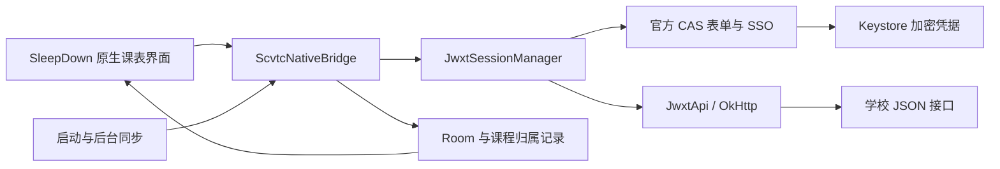

# 川职·课间构建原理

课间直接使用 **SleepDown-Schedule v1.2.6 完整源码**作为原生基底。Miuix 0.9.3 使用基底附带的三份补丁，Kyant Backdrop 沿用项目内的修改版。课程首页、双入口玻璃底栏、切周、设置、课程编辑和 Morph 弹层由原设计系统实现。



## 登录与同步

`ScvtcLoginActivity` 提供原生学号密码表单，任务由应用级 `ScvtcNativeBridge` 执行。`CasAuthManager` 在后台 WebView 中加载真实 CAS，等待官方表单挂载、校验来源和字段，再使用学校自己的提交处理器。CAS Cookie 与教务 Cookie 分开，按实际请求 URL 共享。首次提交的密码先暂存为加密候选，只有学生身份接口返回唯一且匹配的学生后才保存为长期凭据。

页面只观察登录状态，返回首页不会取消任务；身份核验后自动继续课表与成绩同步。只有学校要求验证码或二次认证时才显示补充认证页，主动断开会取消尚未完成的登录。

`JwxtSessionManager` 先调用学生身份 JSON 接口。会话过期时恢复 SSO，必要时通过已验证的官方表单使用本机凭据重新认证，再继续失败的读取。重试有明确超时；学校再次要求验证时提供官方登录入口。页面 URL 不是登录成功依据。

`JwxtApi` 读取以下已确认路径，相对于 `https://jwxt.scvtc.edu.cn/jwgr/api/`：

| 数据 | 路径 |
| --- | --- |
| 学生身份 | `student/studentInfo/querySelf` |
| 当前学期 | `baseInfo/semester/selectCurrentXnXq` |
| 个人课表 | `arrange/CourseScheduleAllQuery/studentCourseSchedule` |
| 实际学期列表 | `baseInfo/semester/selectXnXqListTy` |
| 成绩 | `score/scorequerymanage/studentQuery` |
| 毕业学分要求 | `scheme/majorSchemaCustomize/queryStudentGraduationCredit` |

Hash 路由 `#/jwxt/js/student/index` 只用于 SPA 页面导航。课表只接受真实 JSON，账号、周次和结果完整性必须通过校验后才能写入 Room。网络或认证失败不删除离线课程。

`AcademicRepository` 与课表复用认证与串行同步锁，在 IO 线程读取成绩/学期/毕业要求，完整分页校验后按账号和学期 AES-GCM 加密写入原 Room 缓存表。`CreditSummary` 依据实际成绩中的所得字段和课程代码处理重修；未取得数据不会显示假零值。

`CampusSyncStatus` 区分尝试时间和事务完成时间；课表右上角刷新使用同一桥接，不另建登录链。完全相同的课程安排仅在周视图合并显示，数据库记录保留；单周修改检查实际周次集合。

## 课程与覆盖升级

`ScvtcNativeBridge` 按账号和学期连接到独立课表。归属记录与课程变更在同一个 Room 事务提交；用户手动新增、编辑或删除的课程保留。官方接口没有提供的上下课时间不编造，用户可在课表设置中配置实际作息。

`ScvtcLegacyMigration` 以只读方式访问旧 `openwakeup.db`，将课表、课程安排、周次、作息和日期调课迁移到 SleepDown Room，完成标记和课程同时提交。源数据库保留，迁移不会先清库。旧 Keystore 别名和官方登录加密配置沿用，覆盖升级后可继续使用已保存的认证。

后台任务使用基底的 WorkManager。实际运行时间由 Android、电量与网络条件决定；不承诺每次在固定秒数执行。课表已缓存时，查看课程不依赖后台任务是否刚刚运行。

## 构建

使用 JDK 21、Android SDK Platform 37.0、Build Tools 37.0.0。设置 `JAVA_HOME` 和 `ANDROID_HOME`，从完整源码目录执行：

```sh
./gradlew :app:compileGithubReleaseKotlin --max-workers=1
./gradlew :app:assembleGithubRelease --max-workers=1
```

Windows 使用 `gradlew.bat`。Miuix 来源由 `sleepdown.miuixSourcePath=third-party/miuix` 指定，必须使用带补丁的源码构建，不替换成无补丁的发布组件。

发布构建保留签名校验，需要在本机环境配置 `SLEEPDOWN_RELEASE_STORE_FILE`、`SLEEPDOWN_RELEASE_STORE_PASSWORD`、`SLEEPDOWN_RELEASE_KEY_ALIAS` 和 `SLEEPDOWN_RELEASE_KEY_PASSWORD`。私有配置不写入仓库；覆盖项目历史安装必须保留原证书、`cn.scvtc.campus.preview` 和递增版本码。

赞赏原图通过仓库外环境变量 `SCVTC_DONATION_PNG` 输入，未配置时公开源码不包含私人支付图；签名和原图均不提交。角色、图标与生成提示词见 [BRANDING_20261009.md](BRANDING_20261009.md)。

构建结果、证书、源码对应关系与真实手机结果分别报告。编译通过不代表自动登录、所有升级来源或所有 Android 版本已经通过验收。
